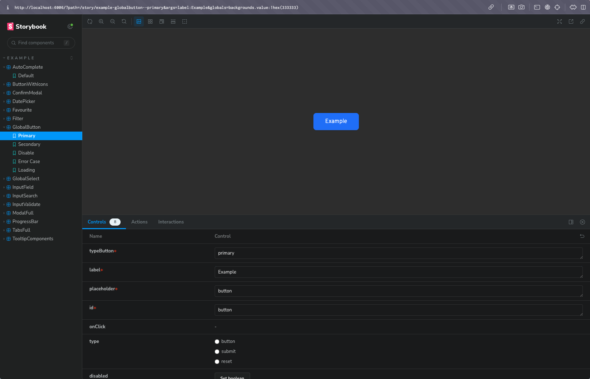

import { Steps } from 'nextra/components'

## About storybook

Storybook คือ Tool สำหรับการพัฒนา UI และการทำงานร่วมกันกับ React, Next, Astro, Vue และ Library หรือ Framework ต่างๆ
ช่วยในการทำ UI Library เป็น Docs ที่บอกได้ว่า UI Components นี้รับ props อะไรและนำไปทำอะไรต่อได้บ้าง 
การ Preview UI ว่าตรงตามที่ออกแบบมาหรือไม่

<Steps>
### Initial Storybook

```zsh
yarn dlx storybook@latest init
```

### Setting script storybook
```json filename="package.json" {10-11}
{
  ...
  "scripts": {
    "dev": "vite",
    "build": "vite build",
    "preview": "vite preview",
    "lint": "eslint --ext .ts --ext .tsx .",
    "lint:fix": "eslint --fix --ext .ts --ext .tsx .",
    "format": "prettier --write .",
    "storybook": "storybook dev -p 6006", // for run localhost storybook
    "build-storybook": "storybook build" // for build storybook
  },
  ...
}
```
</Steps>

### Example storybook

```tsx filename="GlobalButton.tsx" showLineNumbers
import React from 'react';
import { Button } from '@material-tailwind/react';
import { AiOutlineLoading3Quarters } from 'react-icons/ai';

type ButtonProps = {
  placeholder: string;
  onClick?: () => void;
  label: string;
  type?: 'button' | 'submit' | 'reset';
  disabled?: boolean;
  typeButton: string;
  id: string;
  customClass?: string;
  loading?: boolean;
};

const GlobalButton: React.FC<ButtonProps> = ({ placeholder, onClick, label, type, disabled, typeButton, id, customClass, loading }) => {
  return (
    <Button
      className={`w-auto h-12 ${customClass} rounded-lg text-white border-[1.5px] cursor-pointer px-8 ${typeButton === 'primary' && 'bg-primary border-primary'} ${typeButton === 'secondary' && 'bg-transparent border-primary'} 
      ${typeButton === 'error' && 'bg-fail border-fail'}
      ${disabled === true && 'bg-cancel border-cancel text-white !opacity-100 pointer-events-none'} `}
      placeholder={placeholder}
      onClick={onClick}
      type={type}
      disabled={disabled}
      id={id}
    >
      <label className={`cursor-pointer normal-case font-light text-[16px] ${loading && 'hidden'} ${disabled === true && 'pointer-events-none'}`}>
        {label}
      </label>
      <div className="flex justify-center items-center">
        {loading && (
          <AiOutlineLoading3Quarters
            className="animate-spin"
            size={20}
          />
        )}
      </div>
    </Button>
  );
};

export default GlobalButton;
```
ตัวอย่าง Code นี้คือส่วนที่เราทำ Global Component เป็น Button ที่ใช้ในทั้งโปรเจคโดยจะทำการ Preview UI ตัวนี้ด้วย Storybook
และสำหรับเป็น Docs สำหรับ Global Components ไปด้วยโดยการทำไฟล์ stories

```tsx filename="GlobalButton.stories.tsx" showLineNumbers {18, 27, 36, 46, 55}
import type { StoryObj } from '@storybook/react';

import GlobalButton from '@/components/button/GlobalButton'; // import ตัว Global Component เพื่อเขียน story

const meta = {
  title: 'Example/GlobalButton',
  component: GlobalButton,
  tags: ['docsPage'],
  parameters: {
    layout: 'centered',
  },
};

export default meta;

type Story = StoryObj<typeof meta>;

export const Primary: Story = {
  args: {
    typeButton: 'primary',
    label: 'Button',
    placeholder: 'button',
    id: 'button',
  },
};

export const Secondary: Story = {
  args: {
    typeButton: 'secondary',
    label: 'Button',
    placeholder: 'button',
    id: 'button',
  },
};

export const Disable: Story = {
  args: {
    typeButton: 'primary',
    label: 'Button',
    placeholder: 'button',
    id: 'button',
    disabled: true,
  },
};

export const ErrorCase: Story = {
  args: {
    typeButton: 'error',
    label: 'Button',
    placeholder: 'button',
    id: 'button',
  },
};

export const Loading: Story = {
  args: {
    typeButton: 'primary',
    label: 'Button',
    placeholder: 'button',
    id: 'button',
    loading: true,
  },
};
```

เมื่อนำมาใช้งานจะได้หน้าตาประมาณนี้ จะเห็นได้ว่ามี Storybook ที่เป็น GlobalButton ซึ่งจะแบ่ง Case หรือ Type ของ button 
ตาม Story ใน line ที่ 18, 27, 36, 46 และ 55 โดยอิงจาก Global Component ที่เราได้เขียนไว้ตาม Design System
ตั้งแต่เริ่มทำในโปรเจค


