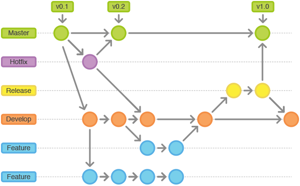

# Git Flow

Git flow คือ หนึ่งในรูปแบบการพัฒนาที่ใช้การทำงานหรือความสามารถของ Branch git 
ในรูปแบบการแตก Branch ออกมาเพื่อพัฒนา feature ที่ต้องการ ซึ่งเราสามารถเลือกใช้ Git flow 
ในการจัดการ Source Code เพื่อพัฒนาให้มีสิทธิภาพมากขึ้น เนื่องจากว่ามีกฎเกณฑ์การใช้งานและมีการทำงานร่วมกันกับคนอื่น 
แต่เราสามารถลดปัญหาที่จะเกิดขึ้นระหว่างการทำงานร่วมกันได้ ปัจจุบันนี้การใช้งาน Git flow ถูกนำมาใช้ในโปรเจ็กต์อย่างแพร่หลาย (แต่ก็ไม่ได้ถูกนำมาใช้ในโปรเจ็กต์ทั้งหมด)



### Conventional Branches

#### Main Branch

```diff
+ main
- master
```

#### UAT/Stg Branch

```diff
+ uat
+ staging
```

#### Development Branch

```diff
+ development
```

#### Feature Branch

```diff
+ feature/feature-1
+ feature/feature-2
```

#### Release Branch

```diff
+ release/release-1
+ release/release-2
```

#### Hotfix Branch

```diff
+ hotfix/hotfix-1
+ hotfix/hotfix-2
```

#### Support Branch

```diff
+ support/support-1
+ support/support-2
```